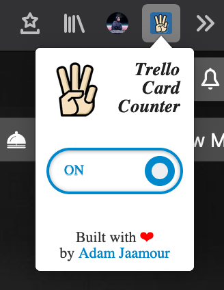

# Trello Card Counter - A Mozilla Firefox Extension

A Mozilla Firefox extension that counts the number of cards in each column of your Trello boards.

## Screenshots

## Usage

Either download from the Firefox Browser Add-Ons store or manually install using instructions below:

* Open Firefox.

* Open the [about:debugging](about:debugging) page.

* Click "This Firefox".

* Click "Load Temporary Add-on".
 
* Select any file in your extension's directory.

## To Do
* see [TODOs: Initial Release](https://github.com/Adamouization/Trello-Card-Counter-Mozilla-Extension/projects/1) project.

## License 
* see [LICENSE](https://github.com/Adamouization/Trello-Card-Counter-Mozilla-Extension/blob/master/LICENSE) file.

## Contact
* Email: adam@jaamour.com
* Website: www.adam.jaamour.com
* LinkedIn: [linkedin.com/in/adamjaamour](https://www.linkedin.com/in/adamjaamour/)
* Twitter: [@Adamouization](https://twitter.com/Adamouization)
