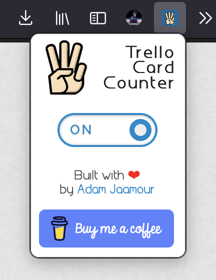
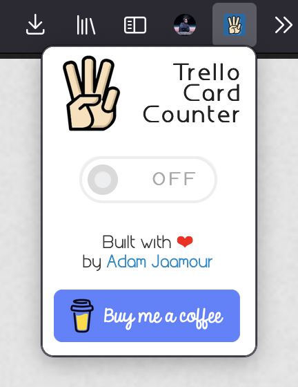

# Trello Card Counter - Mozilla Firefox Extension 

   

Trello Card Counter is a Mozilla Firefox extension that helps Trello users increase their productivity output, while keeping the sleek and elegant design of original Trello boards.

It helps by counting the number of cards in each column and by counting the total number of cards across any Trello board. 

The interactive toggle switch allows users to switch between showing and hiding the card counts in any Trello board.

## Screenshots

Screenshots of the add-on's UI popup:

Popup: ON              | Popup: OFF 
:-------------------------:|:-----------------:
 | 

  Screenshot of the total card count and the card count for individual columns.
 

## Installation Instructions

Either download the official version from the [Firefox Browser Add-Ons store](https://addons.mozilla.org/firefox/addon/trello-card-count/) to get the verified/up-to-date version or manually install using instructions below:

* Open Firefox.

* Open the [about:debugging](about:debugging) page.

* Click "This Firefox".

* Click "Load Temporary Add-on".
 
* Select `manifest.json` in the extension's directory.

## Usage

While visiting any of your Trello boards, click on the extension icon in the top-right taskbar to reveal the number of cards in each column. Use the button to  alternate between showing and hiding the card count.

## Releases

GitHub releases:

* [v1.2]() (08/08/2022)
* [v1.1]() (01/08/2021)
* [v1.0](https://github.com/Adamouization/Trello-Card-Counter-Mozilla-Extension/releases/tag/v1.0) (11/11/2020)

Mozilla releases:
* [Version history](https://addons.mozilla.org/en-US/firefox/addon/trello-card-count/versions/)

## Upcoming Features
* see [TODOs: Initial Release](https://github.com/Adamouization/Trello-Card-Counter-Mozilla-Extension/projects/1) project.
* see [TODOs: Future Release](https://github.com/Adamouization/Trello-Card-Counter-Mozilla-Extension/projects/2) project.

## License 
* see [LICENSE](https://github.com/Adamouization/Trello-Card-Counter-Mozilla-Extension/blob/master/LICENSE) file.

## Contact
* Email: adam@jaamour.com
* Website: www.adam.jaamour.com
* LinkedIn: [linkedin.com/in/adamjaamour](https://www.linkedin.com/in/adamjaamour/)
* Twitter: [@Adamouization](https://twitter.com/Adamouization)

## Support

